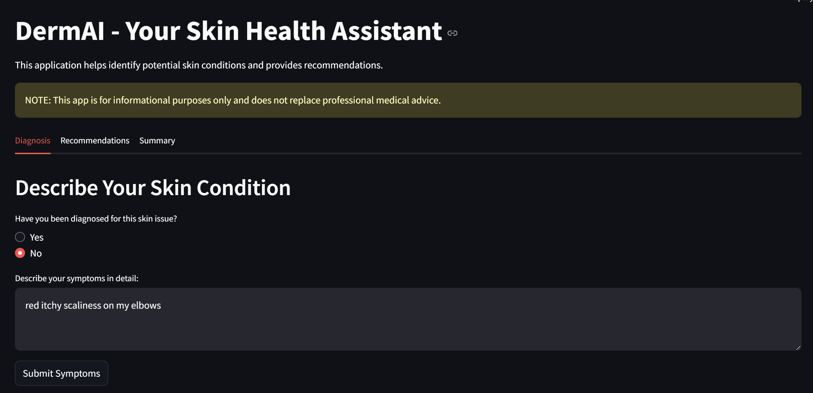
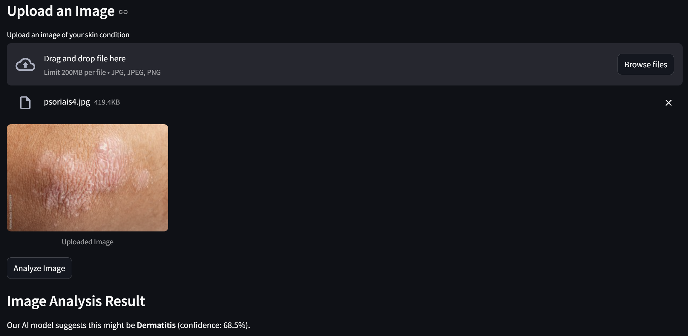
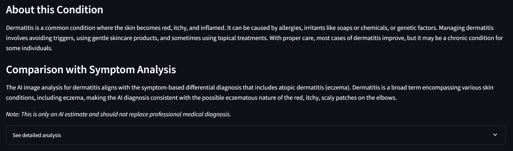
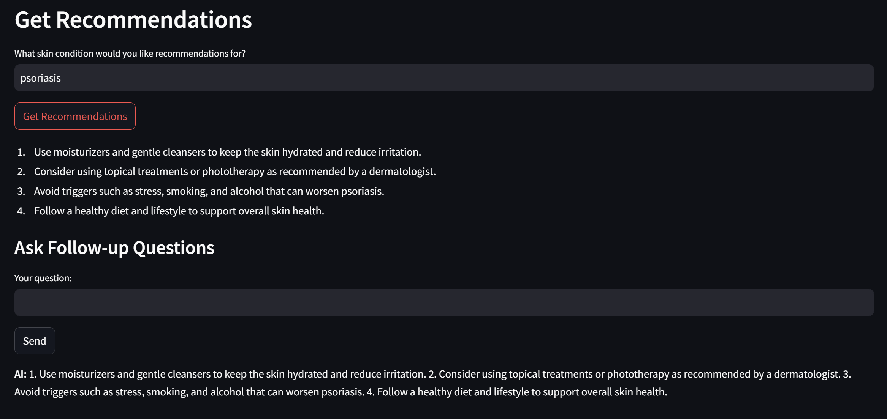
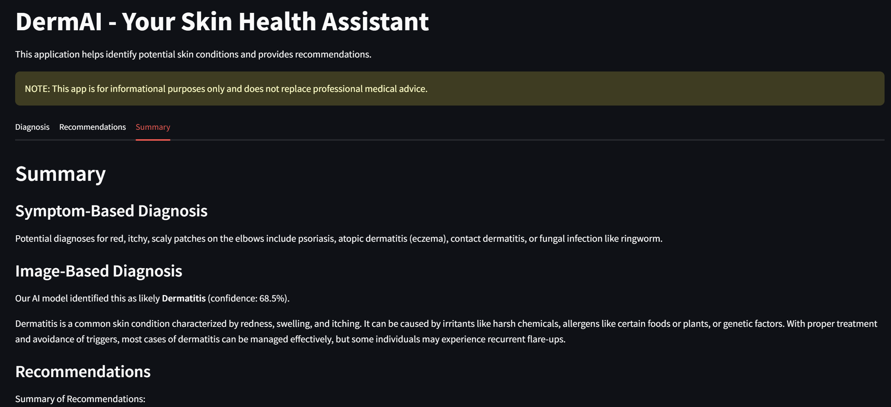
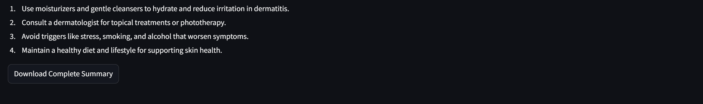

# DermAI - Skin Condition Assistant

DermAI is an AI-powered application that helps identify potential skin conditions through symptom analysis and image recognition. It provides personalized recommendations and educational information about various dermatological conditions.

## Features

- **Symptom Analysis**: Describe your symptoms to get potential diagnoses
- **Image Recognition**: Upload images of skin conditions for AI analysis
- **Condition Information**: Learn about identified skin conditions
- **Personalized Recommendations**: Get tailored advice for managing skin conditions
- **Interactive Chat**: Ask follow-up questions about your condition
- **Comprehensive Summary**: View and download a complete report of your analysis

## Preview

### Diagnosis




### Recommendations


### Summary



## Installation

### Prerequisites

- Python 3.8 or higher
- pip (Python package installer)

### Setup

1. Clone the repository:
   ```
   git clone https://github.com/yourusername/derm-ai.git
   cd derm-ai
   ```

2. Install the required packages:
   ```
   pip install -r requirements.txt
   ```

   This will install all necessary dependencies including:
   - Streamlit
   - OpenAI
   - TensorFlow
   - Pillow
   - protobuf==3.20.3 (specific version required for compatibility)

3. Set up your OpenAI API key:
   ```
   export OPENAI_API_KEY='your-api-key-here'
   ```
   
   On Windows:
   ```
   set OPENAI_API_KEY=your-api-key-here
   ```

## Usage

1. Start the Streamlit application:
   ```
   streamlit run app/streamlit_app.py
   ```

2. Open your web browser and navigate to `http://localhost:8501` (or the URL provided in the terminal)

3. Use the application:
   - Navigate between tabs for different functionalities
   - Describe your symptoms in the Diagnosis tab
   - Upload images of skin conditions for analysis
   - Get recommendations and ask follow-up questions
   - View and download your complete analysis from the Summary tab

## Project Structure

```
derm-ai/
├── app/
│   ├── streamlit_app.py    # Main Streamlit application
│   └── main.py             # Original CLI version (deprecated)
├── CNN/
│   ├── runModel.py         # Image classification model
│   └── ...                 # Other model files
├── requirements.txt        # Project dependencies
└── README.md               # This file
```

## Troubleshooting

- **Image Analysis Issues**: Ensure images are clear, well-lit, and focused on the skin condition
- **TensorFlow Errors**: If you encounter protobuf-related errors, try `pip install protobuf==3.20.3`
- **OpenAI API Errors**: Verify your API key is correctly set as an environment variable

## Disclaimer

DermAI is for informational purposes only and is not a substitute for professional medical advice, diagnosis, or treatment. Always seek the advice of your physician or other qualified health provider with any questions you may have regarding a medical condition.

## Acknowledgments

- OpenAI for providing the GPT models
- TensorFlow for the image classification capabilities
- Streamlit for the web application framework